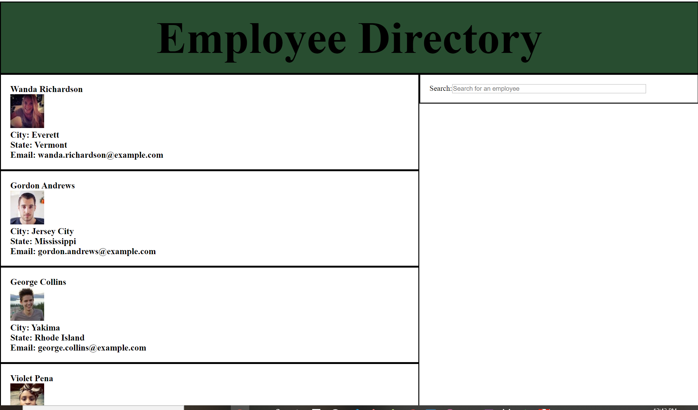

# Employee Directory
This web application is an employee directory. Users can search for an employee in this application.
## How to use the web application
Step 1: Open the app
Step 2: Start searching by typing a name in the search engine.  The directory will update as you type into the search engine.
Step 3: If you backspace and the search engine has zero, it will reload the directory by making another API call

## What is is using?

* React
* Third Party Server: Random user API (https://randomuser.me/api/?results=200&nat=us)

## Business Context
An employee or manager would benefit greatly from being able to view non-sensitive data about other employees. It would be particularly helpful to be able to filter employees by name.

## Visual Example

